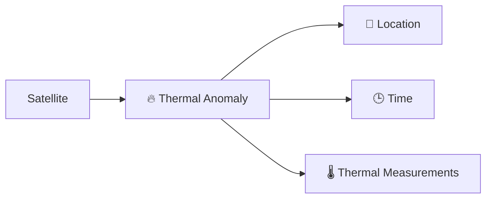
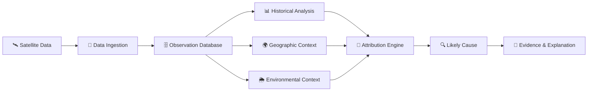
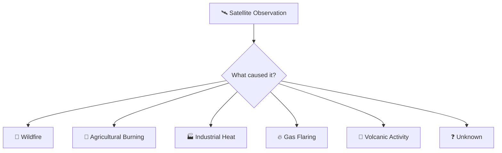
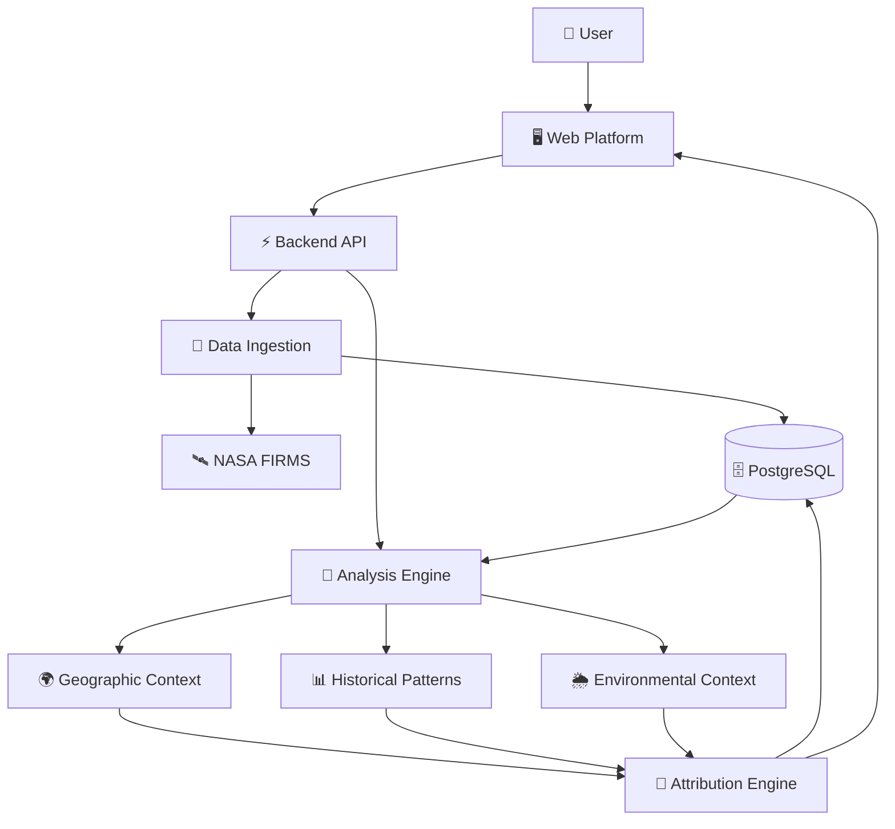
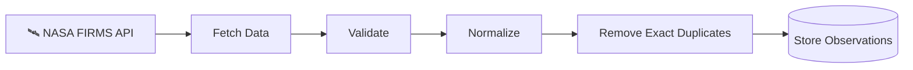
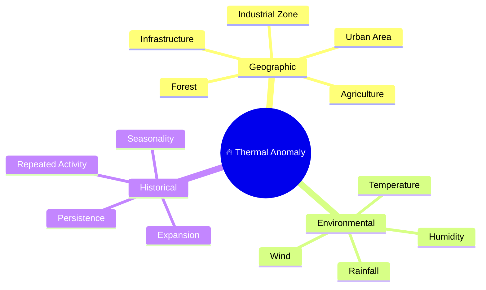
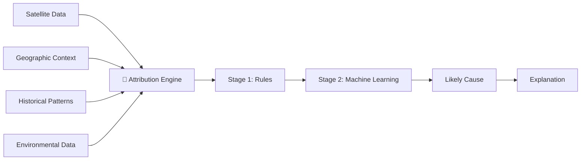
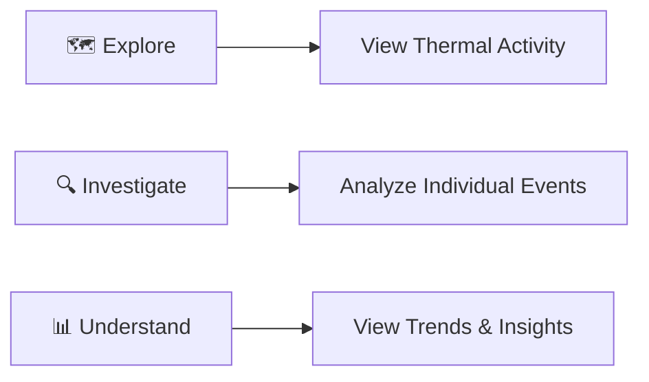
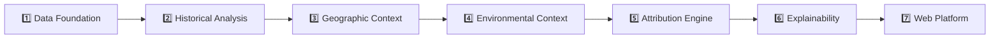

# ThermaSense

### From Satellite Heat Detection to Event Understanding

ThermaSense is a geospatial intelligence platform that investigates **what satellite-detected thermal anomalies may actually represent**.

A hotspot is not always a wildfire. It may be caused by agricultural burning, industrial activity, gas flaring, vegetation fires, or other high-temperature sources.

**ThermaSense adds context to satellite observations to help answer:**

> **What is happening at this location, and what evidence supports that conclusion?**

---

## The Problem

Existing satellite systems can detect unusual thermal activity:



But a thermal detection alone does not explain its cause.

```text
                🔥 HOTSPOT
                    │
        ┌───────────┼───────────┐
        │           │           │
        ▼           ▼           ▼
    🌲 Wildfire  🌾 Agriculture 🏭 Industry
        │
        ├───────────────┐
        ▼               ▼
   🔥 Gas Flare     ❓ Unknown
```

### The Gap

| Existing Detection Systems      | ThermaSense                    |
| ------------------------------- | ------------------------------ |
| Where was heat detected?        | What may have caused it?       |
| Provides satellite observations | Adds contextual intelligence   |
| Detects thermal anomalies       | Investigates thermal anomalies |
| Focuses on detection            | Focuses on attribution         |

---

# How ThermaSense Works



The platform does not rely on a single signal.

Instead, it combines multiple sources of evidence.

```text
Satellite Observation
        +
Location Context
        +
Historical Behaviour
        +
Environmental Conditions
        ↓
   Attribution Analysis
        ↓
Likely Cause + Evidence
```

---

# The Core Idea

A satellite observation is **not the same as a confirmed real-world event**.



ThermaSense treats satellite data as **evidence** and investigates the surrounding context before estimating the most likely explanation.

---

# Architecture



---

# Data Foundation

ThermaSense begins with real satellite thermal anomaly observations.

### Initial Data Sources

| Source     | Role                          |
| ---------- | ----------------------------- |
| NASA FIRMS | Thermal anomaly data provider |
| NOAA-20    | VIIRS satellite observations  |
| NOAA-21    | VIIRS satellite observations  |

The initial ingestion pipeline:



The first goal is simple:

> **Build a reliable pipeline for collecting and storing real satellite observations.**

AI classification is built **after the data foundation is reliable**.

---

# Context Intelligence

A hotspot becomes more meaningful when we understand what exists around it.



These signals will later become features for the attribution engine.

---

# Attribution Engine

The attribution system will evolve in stages.



Potential attribution categories include:

```text
🌲 Wildfire
🌿 Vegetation Fire
🌾 Agricultural Burning
🏭 Industrial Heat
🔥 Gas Flaring
🌋 Volcanic Activity
⚡ Other Thermal Source
❓ Unknown
```

---

# Explainable Results

ThermaSense is not intended to provide a black-box prediction.

Instead of:

```text
Prediction: Wildfire
Confidence: 89%
```

The goal is:

```text
🔥 Likely Cause: Wildfire

Confidence: High

Supporting Evidence

✓ Located near forest land
✓ Low humidity conditions
✓ Dry environmental conditions
✓ Thermal activity expanded over time
✓ No major industrial source detected nearby
```

The system should help users understand **why** a conclusion was reached.

---

# Web Platform

The web application will provide three primary experiences:



### Planned Features

* Interactive thermal anomaly map
* Date and location filtering
* Satellite observation explorer
* Event investigation view
* Historical activity analysis
* Context visualization
* Attribution results
* Evidence-based explanations
* Regional analytics dashboard

---

# Technology Stack

```text
┌──────────────────────────────────────────────┐
│                  FRONTEND                    │
│                                              │
│        Next.js • React • Tailwind CSS        │
├──────────────────────────────────────────────┤
│                  BACKEND                     │
│                                              │
│               Python • FastAPI               │
├──────────────────────────────────────────────┤
│                 DATABASE                     │
│                                              │
│                  PostgreSQL                  │
├──────────────────────────────────────────────┤
│              DATA & INTELLIGENCE             │
│                                              │
│ NASA FIRMS • Pandas • Scikit-learn • GIS     │
│ XGBoost • CatBoost • Context Data Sources    │
└──────────────────────────────────────────────┘
```

---

# Development Roadmap



### Current Focus

**Phase 1 — Data Foundation**

* [x] Identify NASA FIRMS as the initial data source
* [x] Obtain FIRMS API access
* [x] Select NOAA-20 and NOAA-21 data sources
* [x] Design the ingestion architecture
* [ ] Fetch and inspect real satellite data
* [ ] Implement validation and normalization
* [ ] Implement exact deduplication
* [ ] Design the observation database
* [ ] Build the ingestion pipeline

---

# Project Structure

```text
ThermaSense/
│
├── frontend/          # Web application
├── backend/           # API and business logic
│
├── data/              # Data processing
├── ingestion/         # FIRMS data ingestion
├── analysis/          # Historical and contextual analysis
├── intelligence/      # Attribution models and rules
│
├── docs/              # Detailed research and documentation
│
├── README.md
└── LICENSE
```

---

# Project Status

> 🚧 **ThermaSense is currently under active development.**

The current priority is building a reliable satellite data pipeline before introducing advanced intelligence and classification capabilities.

```text
CURRENT

🛰️ Satellite Data
        ↓
📡 Ingestion
        ↓
🗄️ Storage
        ↓
🔜 Context Analysis
        ↓
🔜 Attribution Intelligence
        ↓
🔜 Explainable Results
```

---

# Vision

ThermaSense is built around a simple idea:

> **A satellite can tell us that something is hot. Understanding the surrounding evidence can help us determine what that heat represents.**

The long-term goal is to develop a reusable **thermal anomaly attribution intelligence layer** that can support environmental monitoring, wildfire intelligence, industrial monitoring, geospatial research, and other thermal-event analysis systems.

---

## Data Source

The project uses satellite thermal anomaly data from NASA's FIRMS ecosystem.

[NASA FIRMS](https://firms.modaps.eosdis.nasa.gov/?utm_source=chatgpt.com)

[FIRMS API Documentation](https://firms.modaps.eosdis.nasa.gov/api/?utm_source=chatgpt.com)

---

## Disclaimer

ThermaSense is an active research and development project. Attribution, machine learning, contextual analysis, and confidence scoring described in this repository represent planned or evolving capabilities and should not be interpreted as completed functionality.
