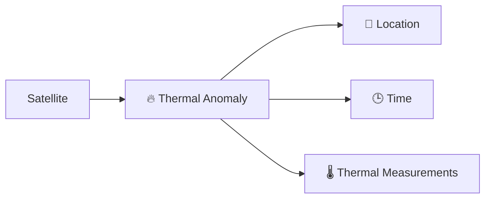
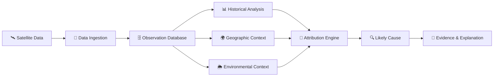
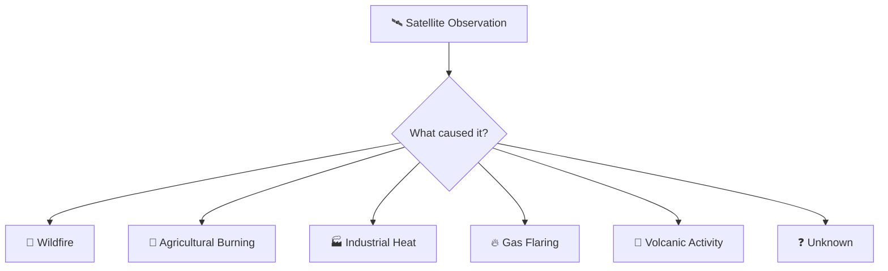
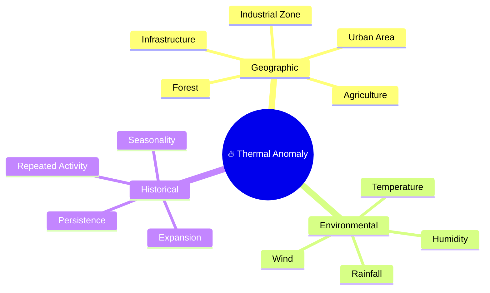
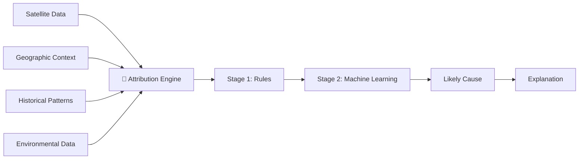

# ThermaSense

### From Satellite Heat Detection to Event Understanding

ThermaSense is a geospatial intelligence platform that investigates **what satellite-detected thermal anomalies may actually represent**.

A hotspot is not always a wildfire. It may be caused by agricultural burning, industrial activity, gas flaring, vegetation fires, or other high-temperature sources.

**ThermaSense adds context to satellite observations to help answer:**

> **What is happening at this location, and what evidence supports that conclusion?**

---

## The Problem

Existing satellite systems can detect unusual thermal activity:



But a thermal detection alone does not explain its cause.

```text
                🔥 HOTSPOT
                    │
        ┌───────────┼───────────┐
        │           │           │
        ▼           ▼           ▼
    🌲 Wildfire  🌾 Agriculture 🏭 Industry
        │
        ├───────────────┐
        ▼               ▼
   🔥 Gas Flare     ❓ Unknown
```

### The Gap

| Existing Detection Systems      | ThermaSense                    |
| ------------------------------- | ------------------------------ |
| Where was heat detected?        | What may have caused it?       |
| Provides satellite observations | Adds contextual intelligence   |
| Detects thermal anomalies       | Investigates thermal anomalies |
| Focuses on detection            | Focuses on attribution         |

---

## How ThermaSense Works



The platform does not rely on a single signal.

Instead, it combines multiple sources of evidence.

```text
Satellite Observation
        +
Location Context
        +
Historical Behaviour
        +
Environmental Conditions
        ↓
   Attribution Analysis
        ↓
Likely Cause + Evidence
```

---

## The Core Idea

A satellite observation is **not the same as a confirmed real-world event**.



ThermaSense treats satellite data as **evidence** and investigates the surrounding context before estimating the most likely explanation.

---

## Context Intelligence

A hotspot becomes more meaningful when we understand what exists around it.



These signals will later become features for the attribution engine.

---

## Attribution Engine

The attribution system will evolve in stages.



Attribution categories include:

```text
🌲 Wildfire
🌿 Vegetation Fire
🌾 Agricultural Burning
🏭 Industrial Heat
🔥 Gas Flaring
🌋 Volcanic Activity
⚡ Other Thermal Source
❓ Unknown
```

---

## Explainable Results

ThermaSense is not intended to provide a black-box prediction.

Instead of:

```text
Prediction: Wildfire
Confidence: 89%
```

The goal is:

```text
🔥 Likely Cause: Wildfire

Confidence: High

Supporting Evidence

✓ Located near forest land
✓ Low humidity conditions
✓ Dry environmental conditions
✓ Thermal activity expanded over time
✓ No major industrial source detected nearby
```

The system should help users understand **why** a conclusion was reached.

---

## Vision

ThermaSense is built around a simple idea:

> **A satellite can tell us that something is hot. Understanding the surrounding evidence can help us determine what that heat represents.**

The long-term goal is to develop a reusable **thermal anomaly attribution intelligence layer** that can support environmental monitoring, wildfire intelligence, industrial monitoring, geospatial research, and other thermal-event analysis systems.

---

## Quick Start

### Prerequisites

- **Python 3.11+** and **pip**
- **Node.js 18+** and **npm**
- A free **NASA FIRMS MAP_KEY** from https://firms.modaps.eosdis.nasa.gov/api/

### 1. Clone and Configure

```bash
cd thermasense
cp .env.example .env
# Edit .env and add your FIRMS_MAP_KEY
```

### 2. Start the Backend

```bash
cd backend
python -m venv venv

# Windows
venv\Scripts\activate
# macOS/Linux
source venv/bin/activate

pip install -r requirements.txt
uvicorn app.main:app --reload --port 8000
```

The API is now running at http://localhost:8000

- Swagger docs: http://localhost:8000/docs
- Health check: http://localhost:8000/health

### 3. Start the Frontend

```bash
cd frontend
npm install
npm run dev
```

The app is now running at http://localhost:3000

### 4. Use ThermaSense

1. Open http://localhost:3000 in your browser
2. Select **NOAA-20** or **NOAA-21** in the sidebar
3. Choose a date range (1–5 days)
4. Click **Fetch Thermal Data**
5. View thermal anomalies as markers on the map
6. Click any marker to inspect its satellite observation details

---

## Project Structure

```
thermasense/
│
├── frontend/                    # Next.js web application
│   ├── src/
│   │   ├── app/                 # Next.js App Router pages
│   │   ├── components/          # Reusable UI components
│   │   ├── features/
│   │   │   ├── map/             # Leaflet map and markers
│   │   │   ├── hotspots/        # Hotspot detail panel
│   │   │   └── dashboard/       # Sidebar, filters, controls
│   │   ├── services/            # API client
│   │   └── types/               # TypeScript interfaces
│   └── package.json
│
├── backend/                     # FastAPI backend
│   ├── app/
│   │   ├── api/
│   │   │   ├── routes/          # API endpoints
│   │   │   └── dependencies/    # Shared dependencies
│   │   ├── services/
│   │   │   ├── firms_service.py       # NASA FIRMS integration
│   │   │   ├── weather_service.py     # Open-Meteo integration
│   │   │   └── geospatial_service.py  # OSM context (placeholder)
│   │   ├── models/              # Domain models
│   │   ├── schemas/             # Pydantic schemas
│   │   ├── core/                # Configuration
│   │   └── main.py              # FastAPI application
│   └── requirements.txt
│
├── docs/
│   ├── architecture.md          # System architecture
│   └── api-integration.md       # External API details
│
├── .env.example
├── docker-compose.yml
└── README.md
```

## API Endpoints

| Method | Endpoint                    | Description                                  |
| ------ | --------------------------- | -------------------------------------------- |
| GET    | `/health`                   | Service health check                         |
| GET    | `/api/hotspots`             | Fetch thermal observations (NASA FIRMS API)  |
| GET    | `/api/hotspots/{id}`        | Get specific observation                     |
| POST   | `/api/ingestion/firms`      | Trigger manual FIRMS ingestion               |
| GET    | `/api/observations`         | List stored database observations            |
| GET    | `/api/observations/{id}`    | Get stored observation by ID                 |
| GET    | `/api/monitoring/status`    | Ingestion scheduler status & health          |
| GET    | `/api/monitoring/logs`      | Ingestion run history logs (paginated)       |
| POST   | `/api/monitoring/run`       | Trigger scheduled ingestion cycle manually   |
| GET    | `/api/context/weather`      | Hourly weather context for observation       |
| GET    | `/api/context/geospatial`   | OpenStreetMap land use & nearby features     |

### Example: Fetch Hotspots

```bash
curl "http://localhost:8000/api/hotspots?satellite=NOAA-20&days=1"
```

### Example: Fetch Weather Context

```bash
curl "http://localhost:8000/api/context/weather?latitude=37.7749&longitude=-122.4194&acquisition_datetime=2026-08-29T12:00:00Z"
```

### Example: Fetch Geospatial Land Use Context

```bash
curl "http://localhost:8000/api/context/geospatial?latitude=37.7749&longitude=-122.4194&radius_m=2000"
```


---

## Technology Stack

| Layer    | Technology                                |
| -------- | ----------------------------------------- |
| Frontend | Next.js, TypeScript, Tailwind CSS, Leaflet|
| Backend  | Python, FastAPI, Pydantic, httpx          |
| Data     | NASA FIRMS, Open-Meteo, OpenStreetMap     |

---

## Data Source

Satellite thermal anomaly data from
[NASA FIRMS](https://firms.modaps.eosdis.nasa.gov/)
using NOAA-20 and NOAA-21 VIIRS instruments.

---

## License

This project is under active development.
